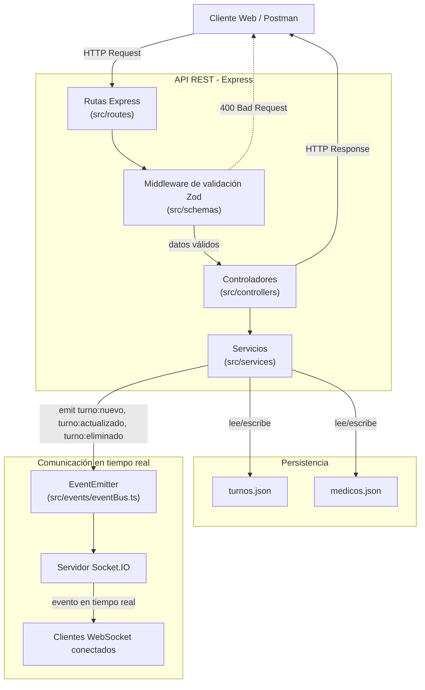
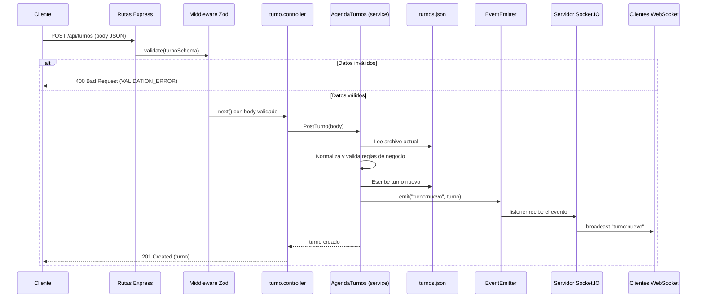

# TurnosRed - Sistema de Gestión de Turnos Médicos

TurnosRed es un prototipo de backend desarrollado en Node.js, Express y TypeScript para centralizar y normalizar la gestión de turnos de centros de atención ambulatoria. Permite procesar archivos JSON con formatos inconsistentes, gestionar operaciones CRUD mediante una API REST, y sincronizar cambios en tiempo real utilizando WebSockets (Socket.IO) y un bus de eventos interno (`EventEmitter`).

---

## 1. Requisitos + instalación + ejecución

## Requisitos previos
- **Node.js** (versión 20.x o superior recomendada) (ver `.nvmrc`).
- npm

## Instalación
```bash
git clone https://github.com/oscarmadrid/gestion-turnos.git
cd gestion-turnos
npm install
cp .env.example .env
```

## Ejecución
```bash
npm run dev      # modo desarrollo (tsx watch)
npm run build    # compila TypeScript a dist/
npm start        # ejecuta el build compilado
```

El servidor levanta por defecto en `http://localhost:3000`. El cliente de prueba de Socket.IO queda disponible en `http://localhost:3000/socket-test-client.html`.

---

## 2. Tabla de Variables de Entorno

Crea un archivo .env en la raíz de tu proyecto e incluye la siguiente configuración para personalizar el comportamiento del servidor:

| Variable | Descripción | Valor por defecto |
|---|---|---|
| `PORT` | Puerto donde escucha el servidor Express | `3000` |
| `DATA_PATH` | Ruta al archivo JSON de persistencia de Turnos | `./data/turnos.json` |
| `MEDICOS_DATA_PATH` | Ruta al archivo JSON de persistencia de Médicos | `./data/medicos.json` |

---

## 3. Scripts Disponibles en package.json

El proyecto incluye los siguientes scripts organizados para el ciclo de vida de desarrollo y producción:

- npm run dev: Inicia el servidor de desarrollo utilizando tsx para reflejar cambios automáticamente en tiempo real sin necesidad de reiniciar manualmente.

- npm run build: Compila todo el código fuente escrito en TypeScript (.ts) a JavaScript plano (.js) dentro de la carpeta de distribución para producción.

- npm start: Ejecuta la aplicación utilizando la versión compilada previamente para entornos de producción.

---

## 4. Estructura de Carpetas y Arquitectura

La arquitectura del proyecto sigue una estricta separación modular de responsabilidades para garantizar mantenibilidad y escalabilidad:

```
gestion-turnos/
├── data/
│   ├── turnos.json
│   └── medicos.json
├── public/
│   └── socket-test-client.html   # Cliente de prueba Socket.IO en tiempo real
├── src/
│   ├── controllers/
│   │   ├── turno.controller.ts   # Maneja req/res de Turnos, delega al service
│   │   └── medico.controller.ts  # Maneja req/res de Médicos, delega al service
│   ├── errors/
│   │   └── AppError.ts           # Clase de error personalizada con status/code
│   ├── events/
│   │   └── eventBus.ts           # EventEmitter centralizado (Node.js)
│   ├── middlewares/
│   │   ├── errorHandler.ts       # Middleware único de manejo de errores
│   │   └── validate.ts           # Middleware genérico de validación con Zod
│   ├── models/
│   │   ├── turno.ts              # Interfaces TurnoCrudo / Turno
│   │   └── medico.ts             # Interfaces MedicoCrudo / Medico
│   ├── routes/
│   │   ├── turno.routes.ts       # Definición de endpoints de Turnos
│   │   └── medico.routes.ts      # Definición de endpoints de Médicos
│   ├── schemas/
│   │   ├── turno.schema.ts       # Validación Zod para Turno
│   │   └── medico.schema.ts      # Validación Zod para Médico
│   ├── services/
│   │   ├── agenda.ts             # Lógica de negocio y persistencia de Turnos
│   │   └── medico.service.ts     # Lógica de negocio y persistencia de Médicos
│   └── index.ts                  # Punto de entrada: Express, HTTP Server, Socket.IO
├── .env
├── .env.example
├── package.json
├── README.md
└── tsconfig.json
```

---

## 5. Nota sobre el ID en la creación de turnos

A diferencia de una API REST convencional, el endpoint `POST /api/turnos` **no autogenera el `id`**: el cliente debe incluirlo explícitamente en el body de la solicitud.

Esta decisión responde al contexto del negocio: TurnosRed centraliza turnos que ya poseen un identificador propio asignado por el sistema de cada sede de origen. Ese `id` no es un valor técnico interno, sino un dato de negocio que debe preservarse para mantener la trazabilidad con el sistema externo del cual proviene el turno.

Si el `id` enviado ya existe en el sistema, la API responde con **400 Bad Request** y un mensaje indicando que el identificador ya está registrado.

**Ejemplo de body válido:**

```json
{
  "id": 200,
  "paciente": "Carlos Ruiz",
  "documento": "31654210",
  "especialidad": "pediatría",
  "fecha": "14/08/2026",
  "hora": "10:00",
  "confirmado": "si"
}
```

---

## 6. Documentación de endpoints + query params

### Endpoints

Todas las respuestas de error siguen este formato estándar:
```json
{
  "status": 400,
  "message": "Descripción del error",
  "code": "CODIGO_DEL_ERROR",
  "details": []
}
```

### Turnos

| Método | Ruta | Descripción |
|---|---|---|
| GET | `/api/turnos` | Lista todos los turnos. Admite filtros por query params. |
| GET | `/api/turnos/:id` | Obtiene un turno por ID. 404 si no existe. |
| POST | `/api/turnos` | Crea un turno. El `id` es obligatorio en el body (identificador de la sede de origen). |
| PUT | `/api/turnos/:id` | Actualiza parcialmente un turno existente. |
| DELETE | `/api/turnos/:id` | Elimina un turno. Devuelve 204 sin body. |

**Filtros disponibles en `GET /api/turnos`:**

| Query param | Ejemplo | Descripción |
|---|---|---|
| `especialidad` | `?especialidad=Pediatría` | Filtra por especialidad (case-insensitive) |
| `fecha` | `?fecha=14/08/2026` | Filtra por fecha exacta |
| `medicoId` | `?medicoId=1` | Filtra por médico asignado |

Ejemplo combinado: `GET /api/turnos?especialidad=Pediatría&fecha=14/08/2026`

### Médicos

| Método | Ruta | Descripción |
|---|---|---|
| GET | `/api/medicos` | Lista todos los médicos. Admite filtros por query params. |
| GET | `/api/medicos/:id` | Obtiene un médico por ID. 404 si no existe. |
| POST | `/api/medicos` | Crea un médico. El `id` se autogenera en el servidor. |
| PUT | `/api/medicos/:id` | Actualiza parcialmente un médico existente. |
| DELETE | `/api/medicos/:id` | Elimina un médico. Devuelve 204 sin body. |

**Filtros disponibles en `GET /api/medicos`:**

| Query param | Ejemplo | Descripción |
|---|---|---|
| `especialidad` | `?especialidad=Odontología` | Filtra por especialidad (case-insensitive) |
| `disponible` | `?disponible=true` | Filtra por disponibilidad (`true` / `false`) |

Ejemplo combinado: `GET /api/medicos?especialidad=Odontología&disponible=true`

---

## 7. Arquitectura y Diagramas

### Arquitectura del sistema



### Flujo de creación de un turno (POST /turnos)



---

## 8. Uso de Inteligencia Artificial

| Tarea | Herramienta | Prompt (resumen) | Respuesta generada | Ajuste manual aplicado |
|---|---|---|---|---|
| Middleware de errores estandarizado | Claude | "Necesito centralizar el manejo de errores con clase AppError y un middleware único" | Clase `AppError`, `errorHandler.ts` y reestructuración de `routes` → `controllers` | Se integró con los servicios existentes reemplazando los `throw new Error` genéricos por `AppError` con status/code |
| CRUD del recurso Médico | Claude | "Agregar CRUD completo de Médico siguiendo la misma arquitectura en capas" | Modelo, servicio, controlador y rutas de Médico | Se decidió autogenerar el `id` en Médico (a diferencia de Turno, donde el id viene de la sede de origen) |
| Validación con Zod | Claude | "Implementar Zod para Turno y Médico, especialidad en Title Case, documento como string" | Schemas `turno.schema.ts`, `medico.schema.ts` y middleware `validate.ts` | Se ajustó el regex de Title Case para admitir tildes y espacios múltiples |
| Filtros por query params | Claude | "Agregar filtros especialidad/fecha/medicoId sin crear endpoints nuevos" | Extensión de `getTurnos` y `getMedicos` con parámetro `filtros` | Se agregó el campo `medicoId` faltante en la interfaz `Turno` y en `normalizarTurno` |
| Colección de Postman + tests | Claude | "Armar tests automatizados con happy path y casos borde para las 10 requests" | Scripts `pm.test()` para cada request, variables de entorno dinámicas | Corrección manual de script mal ubicado (pre-request vs. post-response) y de campos copiados incorrectamente entre Turno y Médico |
| Mock Server | Claude (chat) + AI integrada de Postman | "Simular la API sin backend real a partir de la colección" | Mock handler (`default.js`) generado por el asistente de Postman con seed data | Se corrigió el prefijo de rutas (`/api`) para que coincida con el servidor real |
| Documentación OpenAPI/Swagger | Claude | "Documentar los endpoints existentes con swagger-jsdoc, con schemas reutilizables para Turno, Médico y errores" | `swagger.ts`, anotaciones `@openapi` en cada ruta, publicado en `/api-docs` | Se ajustaron los `tags` y ejemplos para que coincidan con los datos reales usados en Postman |
| Diagramas Mermaid (Docs as Code) | Claude | "Generar un diagrama de componentes y uno de secuencia para POST /turnos, embebidos en el README" | Diagramas Mermaid en Markdown | Verificados visualmente con Mermaid Live Editor y el preview de Markdown de VS Code |
| Autenticación JWT | Claude | "Implementar login/registro con JWT, protegiendo solo las operaciones de escritura" | `auth.service.ts`, `verificarToken.ts`, endpoints `/auth/registro` y `/auth/login` | Se ajustó la protección para dejar los `GET` públicos y proteger selectivamente `POST`/`PUT`/`DELETE` |
| Manejo centralizado de errores (v2) | Claude | "Estandarizar el middleware de errores con la firma de 4 parámetros y nuevos códigos de dominio" | `errorHandler.ts` con firma `(err, req, res, next)` y código `RESOURCE_NOT_FOUND` | Se mantuvo minimalista a pedido propio, sin agregar wrapper `asyncHandler` |
| Logging estructurado (Morgan + Pino) | Claude | "Integrar logging estructurado con Pino, redactando campos sensibles, y Morgan para logs HTTP" | `config/logger.ts` con `redact`, integración en `index.ts`/`app.ts` y en los 3 servicios | Se corrigió manualmente un import incorrecto detectado en una revisión del proyecto completo |
| Suite de tests (Jest + Supertest) | Claude | "Armar tests unitarios con mocks, de integración con Supertest y un E2E secuencial, con cobertura ≥60% en services" | Configuración `jest.config.js` en modo ESM, tests en `tests/`, mocks de `fs/promises`, `bcryptjs` y `jsonwebtoken` | Se separó `app.ts` de `index.ts` para poder testear la app sin levantar el servidor real |
| Reverse proxy con Nginx | Claude | "Configurar Nginx como reverse proxy preservando headers de origen" | `nginx.conf` con `proxy_pass` y headers `Host`/`X-Real-IP`/`X-Forwarded-For` | Validado localmente con Nginx vía Homebrew, confirmado con `curl` que las respuestas vía proxy son idénticas a las directas |

---

## 9. Autenticación

La API utiliza **JSON Web Tokens (JWT)** para proteger las operaciones de escritura. Las operaciones de lectura (`GET`) son públicas.

### Flujo de autenticación

1. **Registro:** `POST /api/auth/registro` con `email`, `password` y `rol` (`admin` o `recepcion`). La contraseña se almacena hasheada con `bcryptjs`, nunca en texto plano.
2. **Login:** `POST /api/auth/login` con `email` y `password`. Si las credenciales son válidas, devuelve un `token` JWT firmado (payload: `id`, `rol`) y los datos públicos del usuario.
3. **Uso del token:** las operaciones protegidas requieren el header `Authorization: Bearer <token>`.

### Endpoints de autenticación

| Método | Ruta | Descripción | Protegido |
|---|---|---|---|
| POST | `/api/auth/registro` | Crea un usuario nuevo | No |
| POST | `/api/auth/login` | Autentica y devuelve un token JWT | No |

### Rutas protegidas

| Recurso | GET (lectura) | POST / PUT / DELETE (escritura) |
|---|---|---|
| Turnos | Público | Requiere `Authorization: Bearer <token>` |
| Médicos | Público | Requiere `Authorization: Bearer <token>` |

Si el token falta, es inválido o expiró, la API responde `401` con los códigos `AUTH_TOKEN_MISSING` o `AUTH_TOKEN_INVALID` respectivamente, siguiendo el formato estándar de error (ver sección 6).

---

## 10. Pruebas y Cobertura

El proyecto cuenta con una suite de tests automatizados con **Jest** y **Supertest**, organizada en tres niveles:

- **Tests unitarios** (`tests/agenda.test.ts`, `tests/medico.service.test.ts`, `tests/auth.service.test.ts`): prueban la lógica de negocio de cada servicio de forma aislada, mockeando el sistema de archivos (y `bcryptjs`/`jsonwebtoken` en el caso de autenticación) para no depender de I/O real.
- **Tests de integración** (`tests/turnos.integration.test.ts`): levantan la app de Express completa (sin arrancar un servidor real) y prueban los endpoints HTTP de punta a punta contra archivos de datos de prueba aislados (`tests/fixtures/`), cubriendo casos de éxito (`201`), validación (`400`) y autenticación (`401`).
- **Test E2E secuencial** (`tests/flujo-e2e.test.ts`): simula el flujo completo de un usuario real en orden — registro → login → crear turno → consultarlo → actualizarlo → eliminarlo → confirmar que ya no existe.

### Cómo correr los tests

```bash
npm test
```

Esto ejecuta toda la suite y genera un reporte de cobertura en la terminal, limitado a `src/services/**` (el requisito de la consigna es ≥60% ahí).

### Cómo interpretar el reporte de cobertura

File               | % Stmts | % Branch | % Funcs | % Lines
-------------------|---------|----------|---------|--------
agenda.ts          |   84.53 |       76 |   71.42 |   93.75
auth.service.ts    |   91.42 |     87.5 |      75 |   93.75
medico.service.ts  |   92.53 |    81.08 |   94.11 |   94.54

- **% Stmts (Statements):** porcentaje de líneas de código ejecutadas al menos una vez por los tests.
- **% Branch:** porcentaje de ramas condicionales cubiertas (ej. ambos lados de un `if`).
- **% Funcs:** porcentaje de funciones/métodos invocados por algún test.
- **% Lines:** porcentaje de líneas de código cubiertas (similar a Stmts, a nivel de línea).

El proyecto mantiene los 4 indicadores por encima del 60% exigido en los tres servicios principales.

---

## 11. Despliegue (Reverse Proxy con Nginx)

En un escenario de despliegue, la aplicación Node no se expone directamente: se coloca **Nginx** delante como reverse proxy, usando la configuración de `nginx.conf` en la raíz del proyecto.

### Validación local

```bash
# Terminal 1: levantar la app
npm run dev

# Terminal 2: levantar Nginx con la config del proyecto
nginx -c "$(pwd)/nginx.conf"

# Terminal 3: probar que el proxy reenvía correctamente
curl -i http://localhost:8080/api/turnos
```

La respuesta a través del proxy (puerto 8080) es idéntica a la obtenida accediendo directamente al puerto 3000, confirmando que `proxy_pass` y los headers `Host`, `X-Real-IP`, `X-Forwarded-For` y `X-Forwarded-Proto` están correctamente configurados (ver `docs/adr/ADR-003-uso-de-nginx.md` para el detalle de la decisión).

Para detener Nginx:
```bash
nginx -s stop -c "$(pwd)/nginx.conf"
```